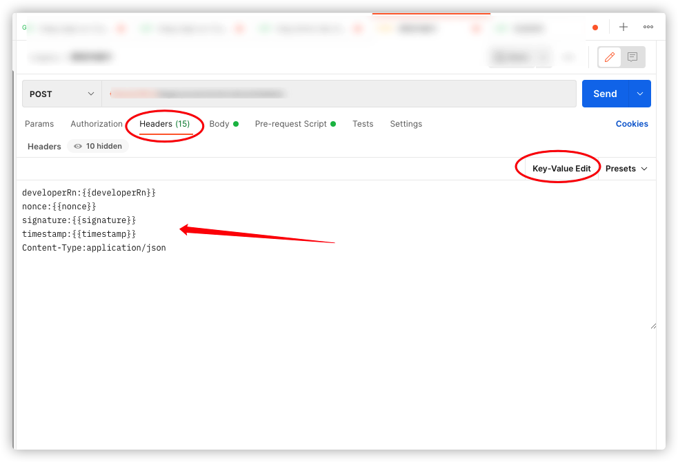
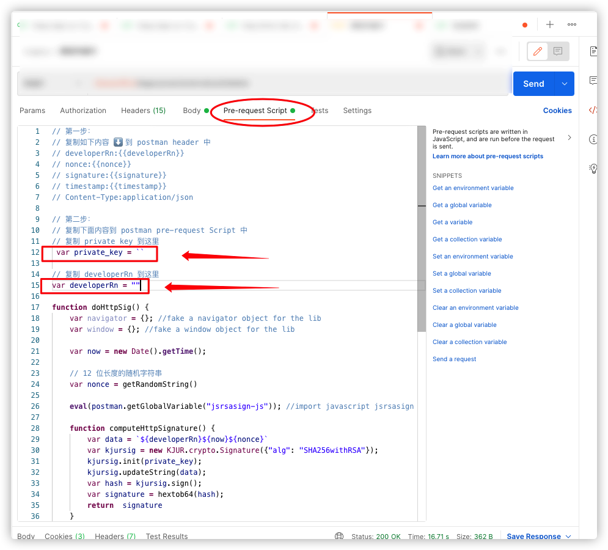

# postman-pre-request-rsasign

## 签名策略

签名的字符串：`${developerRn}${now}${nonce}`<br/>

`字段解释`
`now` = 当前时间戳<br/>
`nonce` = 12 位随机字符串<br/>
`developerRn` = 开发者资源名（纯字符串）<br/>

// 如需修改签名策略，可手动修改源码拼接字符串部份的逻辑<br/>

## 操作指南

#### 第一步：
复制如下内容 ⬇️ 到 postman header 中<br/>
[代码](./preRequest.js)
```
developerRn:{{developerRn}}
nonce:{{nonce}}
signature:{{signature}}
timestamp:{{timestamp}}
Content-Type:application/json
```


#### 第二步：
复制下面内容到 postman pre-request Script 中<br/>
复制 private key 到代码中<br/>
复制 developer rn 到代码中<br/>
<br/>

#### 第三步：
把请求和签名无关的所有参数填入 postman<br/>
点击 send 发送请求<br/>
